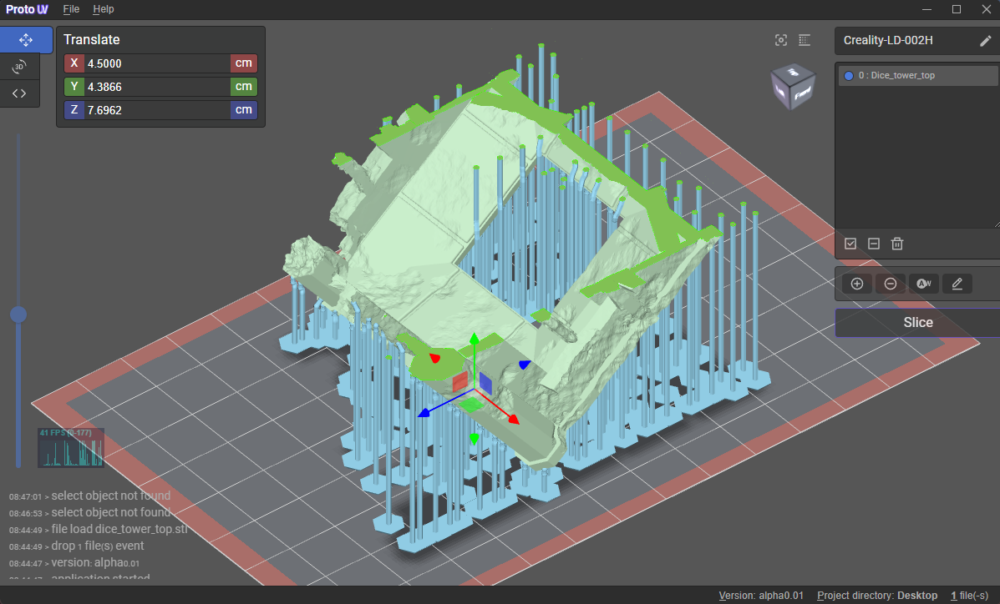

## About

<p>
  ProtoUV it's open-source slicer for a photopolymer 3d printers, written on TypeScript with base on Electron. Uses <a href="https://facebook.github.io/react/">React</a>, <a href="https://threejs.org/">ThreeJs</a>, <a href="https://threejs.org/">ThreeJs</a>, <a href="https://www.electronjs.org/">Electron</a>, <a href="https://github.com/sn4k3/UVtools">uvtools</a> and many other deps. 
</p>


[](https://github.com/sn4k3/UVtools/blob/master/LICENSE)
[](#)
[](#)
[](https://github.com/fariarx/ProtoUV/releases)
[](https://github.com/fariarx/ProtoUV/releases)


## Program support

The software is actively development, refined and improved if there is a demand for it. At the time of launch, the program is at the **alpha**🔥 testing stage.

## Deployment

Clone the repo and install dependencies:

```bash
git clone --depth 1 --branch main https://github.com/Fariarx/ProtoUV.git protouv
cd protouv
yarn install
yarn run start
```

## Donations

**Donations will ensure the following:**

- 🔨 Long term maintenance of the project
- 🐛 Quick responses to bug reports and help requests

All my work here is given for free (OpenSource), it took some long month to development, test and polish the program and the best solutions for him. If you're happy to contribute for a better program and for my work i will appreciate the tip.
Use one of the following methods:

2. [x] Dogecoin🐶 DNhTndaAoj99GwT1KksPVSdyG41c4gjbPJ
1. [x] Paypal https://paypal.me/Fariarx

## Maintainer

- [Chall4](https://github.com/fariarx) 

## License

MIT © [ProtoUV](https://github.com/Fariarx/ProtoUV)
