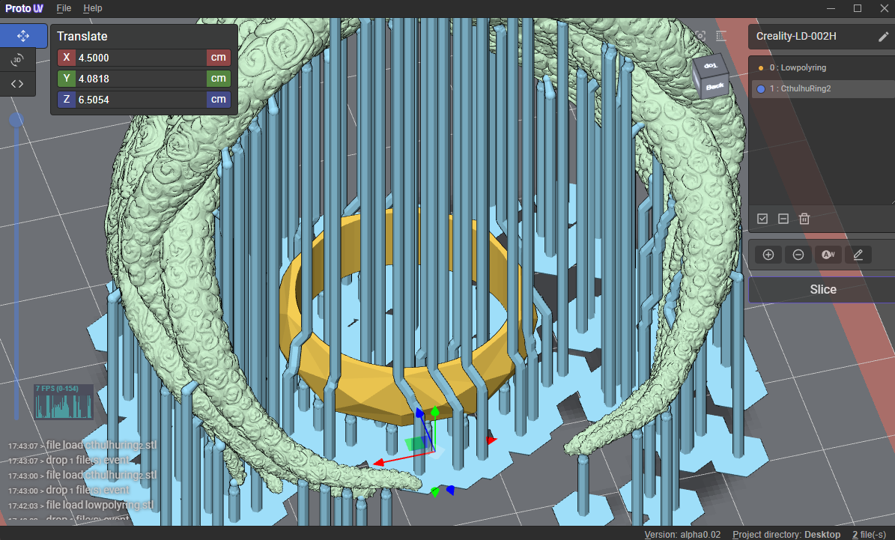
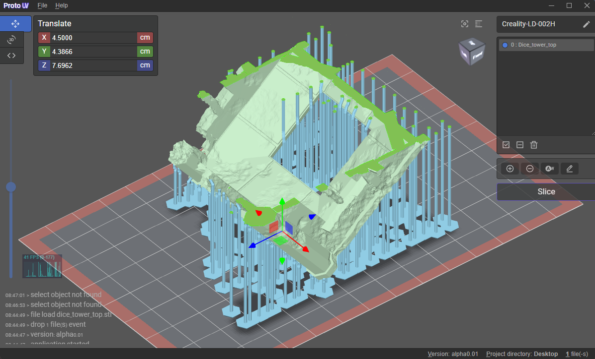
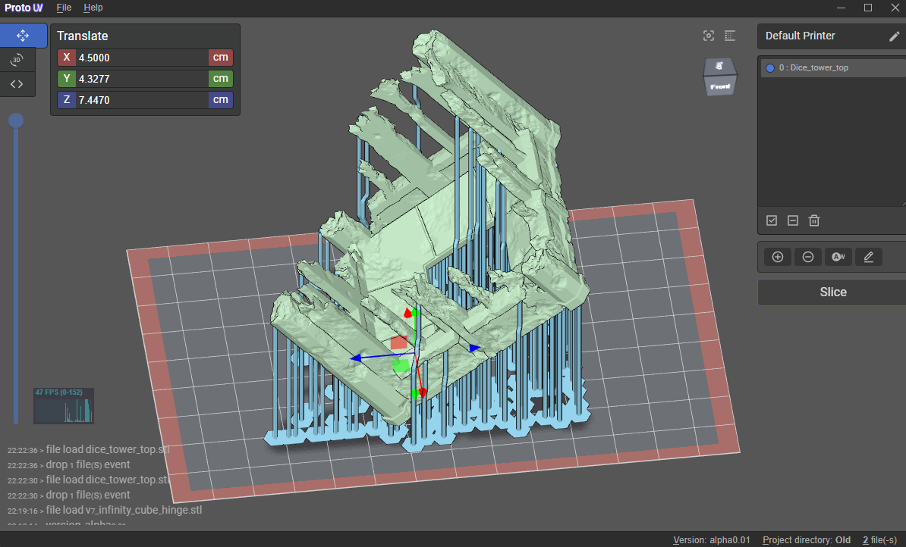
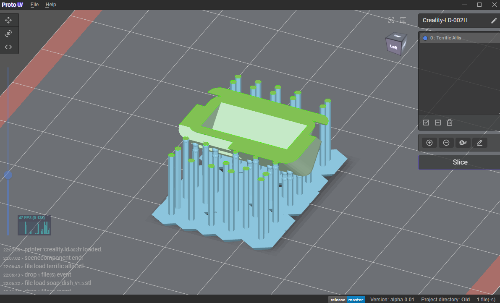
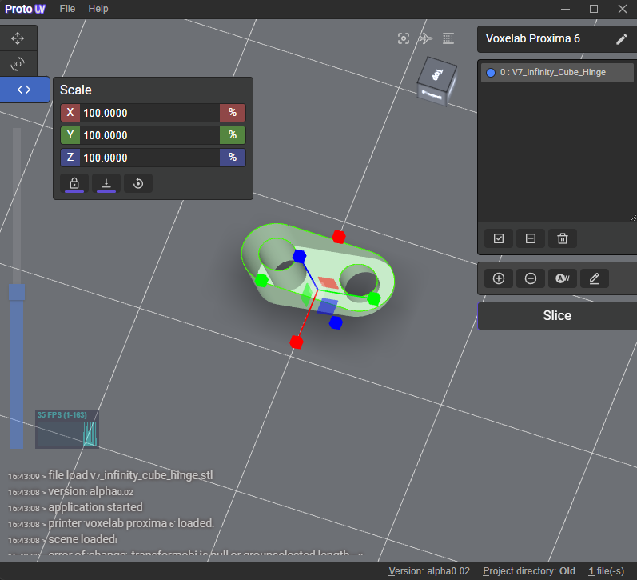
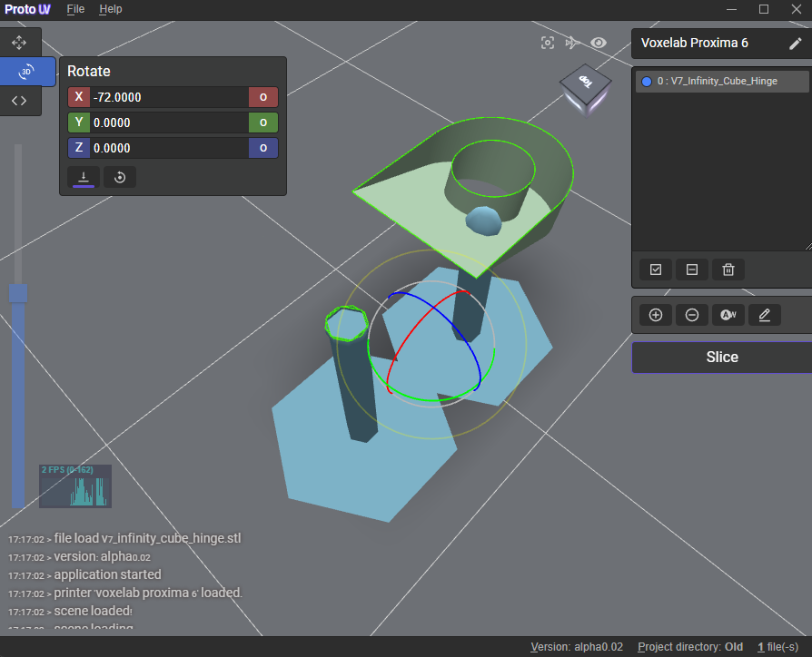

## About

<p>
  ProtoUV is an open-source slicer for photopolymer 3d printers, written on TypeScript with base on Electron. Uses <a href="https://facebook.github.io/react/">React</a>, <a href="https://threejs.org/">ThreeJs</a>, <a href="https://github.com/gkjohnson/three-mesh-bvh">three-mesh-bvh</a>, <a href="https://www.electronjs.org/">Electron</a>, <a href="https://github.com/sn4k3/UVtools">uvtools</a> and many other deps. 
</p>


<details><summary>More screenshots (click me)</summary>
<p>





</p>
</details>

[](https://github.com/Fariarx/ProtoUV/blob/main/LICENSE)
[](#)
[](#)
[](https://github.com/fariarx/ProtoUV/releases)
[](https://github.com/fariarx/ProtoUV/releases)


## Program support

The software is actively development, refined and improved if there is a demand for it. At the time of launch, the program is at the **alpha**🔥 testing stage.

## Known printers

So far, there are not so many configurations, but in the future it is planned to fix this.
Most of the known formats for photopolymer printers are 😺**supported by the program**. All formats are known from <a href="https://github.com/sn4k3/UVtools">uvtools page</a>, namely: 

<details><summary>Known file formats (click me)</summary>
<p>
SL1 (PrusaSlicer), SL1S (PrusaSlicer), Zip (Chitubox), Photon (Chitubox), Photons (Chitubox), CBDDLP (Chitubox), CTB (Chitubox), PHZ (Chitubox), FDG (Voxelab), PWS (Photon Workshop), PW0 (Photon Workshop), PWX (Photon Workshop), DLP (Photon Workshop), DL2P (Photon Workshop), PWMO (Photon Workshop), PWMA (Photon Workshop), PWMS (Photon Workshop), PWMX (Photon Workshop), PMX2 (Photon Workshop), PWMB (Photon Workshop), PWSQ (Photon Workshop), PM3 (Photon Workshop), PM3M (Photon Workshop), PM3R (Photon Workshop), PWC (Photon Workshop), JXS (GKone Slicer), ZCode (UnizMaker), ZCodex (Z-Suite), CWS (NovaMaker), RGB.CWS (Nova Bene4 Mono / Elfin2 Mono SE), XML.CWS (Wanhao Workshop), MDLP (Makerbase MKS-DLP v1), GR1 (GR1 Workshop), CXDLP (Creality Box), LGS (Longer Orange 10), LGS30 (Longer Orange 30), LGS120 (Longer Orange 120), LGS4K (Longer Orange 4K & mono), Flashforge SVGX, Anet N4, Anet N7, ZIP (Generic / Phrozen Zip), VDA.ZIP (Voxeldance Additive), VDT (Voxeldance Tango), OSF (Vlare Open File Format), UVJ (Zip file format for manual manipulation), Image files (png, jpg, jpeg, jp2, tif, bmp, pbm, pgm, ras, sr)
</p>
</details>

## Deployment

Clone the repo and install dependencies:

```bash
git clone --depth 1 --branch main https://github.com/Fariarx/ProtoUV.git protouv
cd protouv
yarn install
yarn run start
```

## Maintainer

- [Fariarx](https://github.com/fariarx) 

## License

MIT © [ProtoUV](https://github.com/Fariarx/ProtoUV)
